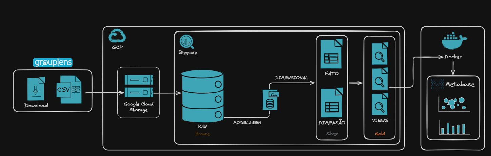
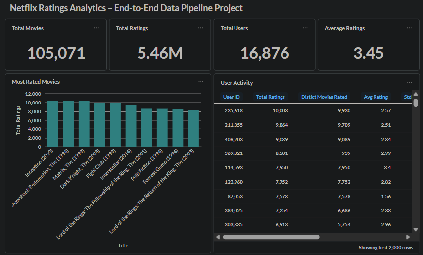
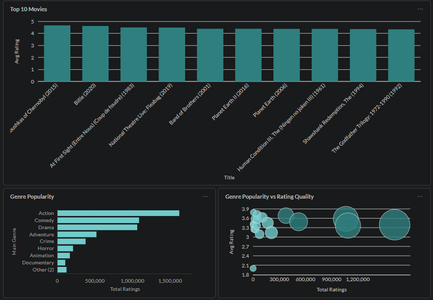
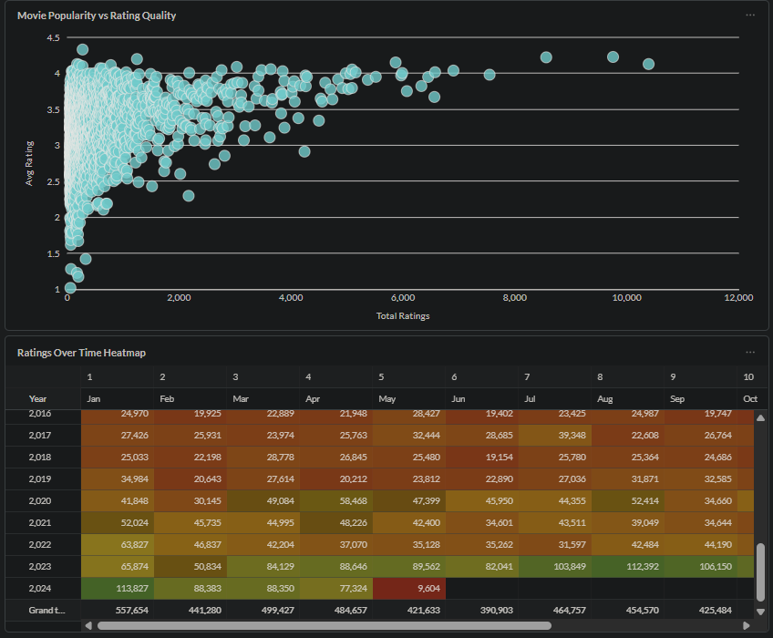

Built a complete end-to-end data pipeline using real-world data engineering concepts:
data ingestion, transformation, dimensional modeling and BI visualization.

# netflix-ratings-data-pipeline
End-to-end data pipeline for Netflix ratings analytics using BigQuery and Metabase
# Netflix Ratings Analytics

End-to-end data pipeline project built with Google Cloud Platform, BigQuery and Metabase to analyze movie ratings data.

## Overview
This project was designed to simulate a real-world analytics workflow, from raw data ingestion to business-oriented dashboards.

## Data Source
- GroupLens MovieLens Dataset

## Architecture

The pipeline follows a layered structure:

- **Bronze**: raw data ingestion and storage
- **Silver**: dimensional modeling with fact and dimension tables
- **Gold**: analytical views used for dashboards and insights

## Tech Stack
- Google Cloud Storage
- BigQuery
- SQL
- Metabase
- Docker

## Dashboard Preview




## Project Structure
```text
sql/
docs/
README.md

## Key Learnings
- Built a layered data architecture (Bronze, Silver, Gold)
- Handled dirty data (NULLs, invalid values like -1 ratings)
- Designed fact and dimension tables
- Created analytical views for business insights
- Built a dashboard focused on decision-making
